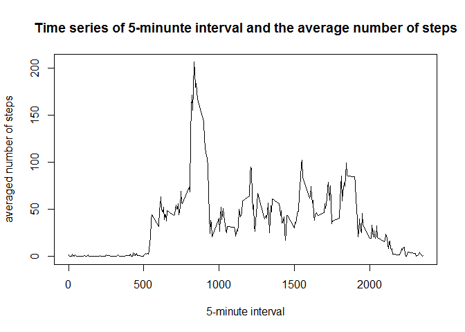

# Reproducible Research: Peer Assessment 1


## Loading and preprocessing the data


```r
data <- read.csv(unz("activity.zip", "activity.csv"))

head(data)
```

```
##   steps       date interval
## 1    NA 2012-10-01        0
## 2    NA 2012-10-01        5
## 3    NA 2012-10-01       10
## 4    NA 2012-10-01       15
## 5    NA 2012-10-01       20
## 6    NA 2012-10-01       25
```

```r
data$date <- as.Date(data$date, "%Y-%m-%d")

str(data)
```

```
## 'data.frame':	17568 obs. of  3 variables:
##  $ steps   : int  NA NA NA NA NA NA NA NA NA NA ...
##  $ date    : Date, format: "2012-10-01" "2012-10-01" ...
##  $ interval: int  0 5 10 15 20 25 30 35 40 45 ...
```


## What is mean total number of steps taken per day?

### Histogram of the total number of steps taken each day


```r
summa <- tapply(data$steps, data$date, sum, na.rm=TRUE)

hist(summa, breaks=10, xlab = "sum of steps per day", main = "Total number of steps taken each day")
```

 

### Mean and median total number of steps taken per day


```r
mean(summa)
```

```
## [1] 9354.23
```

```r
median(summa)
```

```
## [1] 10395
```

## What is the average daily activity pattern?

### Time series plot


```r
avgsteps <- tapply(data$steps, data$interval, mean, na.rm=TRUE)

plot(avgsteps ~ unique(data$interval), type="l", xlab = "5-minute interval", 
     ylab="averaged number of steps", 
     main="Time series of 5-minunte interval and the average number of steps")
```

 

### 5-minute interval which contains the maximum number of steps, on average across all the days in the dataset


```r
avgsteps[which.max(avgsteps)]
```

```
##      835 
## 206.1698
```

## Imputing missing values

### Total number of missing values in the dataset (i.e. the total number of rows with NAs)


```r
table(is.na(data) == TRUE)
```

```
## 
## FALSE  TRUE 
## 50400  2304
```

```r
length(data$steps[is.na(data$steps)])
```

```
## [1] 2304
```

### Filling in all of the missing values in a new dataset with the mean for that 5-minute interval


```r
data2 <- data  # new dataset without NAs
for (i in 1:nrow(data)){
  if(is.na(data$steps[i])){
    data2$steps[i]<- avgsteps[[as.character(data[i, "interval"])]]
  }
}
```

### Histogram of the total number of steps taken each day from the new dataset


```r
summa2 <- tapply(data2$steps, data2$date, sum, na.rm=TRUE)

hist(summa2, breaks=10, xlab = "sum of steps per day", main = "Total number of steps taken each day")
```

 

### Comparasion between Mean and median total number of steps taken per day from the two datasets


```r
mean1<-mean(summa)
mean2<-mean(summa2)

median1<-median(summa)
median2<-median(summa2)

summary<-rbind(data.frame(mean=c(mean1,mean2),median=c(median1,median2)))
rownames(summary) <- c("with NAs", "without NAs")

print(summary)
```

```
##                 mean   median
## with NAs     9354.23 10395.00
## without NAs 10766.19 10766.19
```

The mean and the median from the new dataset (without NAs) are exactly the same. And both are higher than the mean and the median from the original dataset. We can assume that the distribution of the steps from the original dataset is skewed than the steps distribution on the second dataset.


## Are there differences in activity patterns between weekdays and weekends?

### 


```r
# new column
data2$day <- ifelse(weekdays(data2$date) %in% 
                        c("Saturday","Sunday","sábado", "domingo"), "weekend", "weekday")
# subset the data
data2weekend <- subset(data2, data2$day == "weekend")
data2weekday <- subset(data2, data2$day == "weekday")

# mean steps per subseted data
avgweekend <- tapply(data2weekend$steps, data2weekend$interval, mean)
avgweekday <- tapply(data2weekday$steps, data2weekday$interval, mean)

# new data frame with the mean by interval and by type of days
df_weekend<-data.frame(interval=unique(data2weekend$interval),
                       avg=as.numeric(avgweekend),day=rep("weekend",length(avgweekend)))

df_weekday<-data.frame(interval=unique(data2weekday$interval),
                       avg=as.numeric(avgweekday),day=rep("weekday",length(avgweekday)))

df_final<-rbind(df_weekend,df_weekday)


# the plot with ggplot2
library(ggplot2)
```

```
## Warning: package 'ggplot2' was built under R version 3.1.3
```

```r
g <- ggplot (df_final, aes (interval, avg))
g + geom_line(color="red") + facet_grid (day~.) + theme_bw() + labs(x= "interval", y="mean steps")
```

 

Activity on the weekends tends to be more spread out than the weekdays
